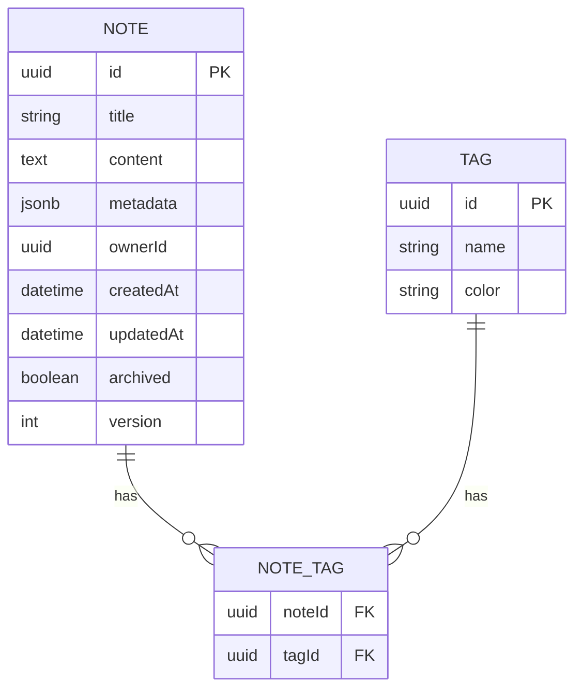

---
# Global deck settings
theme: default
title: "Notes App — Features & Design Overview"
info: |
  Ocean Professional themed Slidev deck describing the Notes App: features, design, architecture, data model, API, security, performance, roadmap, and demo flow.
class: text-left
mdc: true
transition: slide-left
fonts:
  sans: Inter, ui-sans-serif, system-ui, -apple-system, Segoe UI, Roboto, Helvetica Neue, Arial
  mono: ui-monospace, SFMono-Regular, Menlo, Monaco, Consolas, "Liberation Mono", "Courier New", monospace
css: |
  @import "./style.css";
---

# Notes App
<div class="title-slide with-hero-glow">
  <div class="hero-copy">
    <h2 class="text-hero">Fast. Organized. Secure.</h2>
    <p class="subtitle text-md">A modern notes application for individuals and teams</p>
    <div class="subtitle text-xs">Ocean Professional • v1.0 • {{ new Date().toLocaleDateString() }}</div>
    <div class="hero-ctas mt-2">
      <a class="btn-primary" href="#demo-flow">View Demo Flow</a>
      <a class="btn-secondary" href="#architecture">Skip to Architecture</a>
    </div>
  </div>
</div>

---

# Problem & Goals

<div class="problem-grid">
  <div class="problem-card">
    <div class="eyebrow">The Problem</div>
    <h3 class="feature-title">Information Scattered Everywhere</h3>
    <ul class="points-clean">
      <li>Notes across devices and services</li>
      <li>Poor search and tagging consistency</li>
      <li>No offline-first approach</li>
    </ul>
  </div>

  <div class="problem-card">
    <div class="eyebrow">User Pain</div>
    <h3 class="feature-title">Context Switching & Lost Ideas</h3>
    <ul class="points-clean">
      <li>Slow capture → missed notes</li>
      <li>Hard to organize at scale</li>
      <li>Inconsistent sync across devices</li>
    </ul>
  </div>

  <div class="problem-card">
    <div class="eyebrow">Goals</div>
    <h3 class="feature-title">Fast, Reliable, Delightful</h3>
    <ul class="points-clean">
      <li>Instant capture and search</li>
      <li>Flexible tagging and filters</li>
      <li>Seamless sync and offline mode</li>
    </ul>
  </div>
</div>

---

# Feature Set

<div class="card-grid three mt-2">
  <div class="feature-card"><h3 class="feature-title">Create Notes</h3><p class="muted">Markdown and rich text support</p></div>
  <div class="feature-card"><h3 class="feature-title">Edit & Version</h3><p class="muted">Autosave with history</p></div>
  <div class="feature-card"><h3 class="feature-title">Delete/Archive</h3><p class="muted">Soft-delete with restore</p></div>
  <div class="feature-card"><h3 class="feature-title">Tags & Folders</h3><p class="muted">Organize with labels and structure</p></div>
  <div class="feature-card"><h3 class="feature-title">Search</h3><p class="muted">Full-text, tag filters, date ranges</p></div>
  <div class="feature-card"><h3 class="feature-title">Sync</h3><p class="muted">Real-time sync with conflict resolution</p></div>
  <div class="feature-card"><h3 class="feature-title">Offline</h3><p class="muted">Local cache and queued updates</p></div>
  <div class="feature-card"><h3 class="feature-title">Sharing</h3><p class="muted">Link-based or team spaces</p></div>
  <div class="feature-card"><h3 class="feature-title">Shortcuts</h3><p class="muted">Keyboard-first UX</p></div>
</div>

---

# Ocean Professional Design System

<div class="split-cols mt-2">
  <div class="left">
    <div class="feature-card">
      <div class="eyebrow">Palette</div>
      <ul class="points-clean">
        <li>Primary: <code>#2563EB</code></li>
        <li>Secondary/Success: <code>#F59E0B</code></li>
        <li>Error: <code>#EF4444</code></li>
        <li>Background: <code>#f9fafb</code>, Surface: <code>#ffffff</code></li>
        <li>Text: <code>#111827</code></li>
        <li>Gradient: from-blue-500/10 → to-gray-50</li>
      </ul>
    </div>

    <div class="feature-card">
      <div class="eyebrow">Components</div>
      <ul class="points-clean">
        <li>Rounded cards with subtle shadows</li>
        <li>Badges and callouts for emphasis</li>
        <li>Code blocks with ocean tint</li>
      </ul>
    </div>
  </div>
  <div class="right">
    <div class="glass-frame tall">
      <div class="placeholder">Sample UI: Editor + Tag bar + Search</div>
    </div>
  </div>
</div>

---

id: architecture
# Architecture Overview

```mermaid
%%{init: {
  "theme": "dark",
  "themeVariables": {
    "primaryTextColor": "#E6EDF3",
    "primaryColor": "#0B1220",
    "lineColor": "#6E7681"
  }
}}%%
flowchart LR
    Client[🧑‍💻 Client (Web/Mobile)] -->|HTTPS| Edge[CDN/Edge]
    Edge --> App[Notes App Frontend]
    App -->|REST/WS| API[(API Service)]
    API --> Auth[🔐 Auth Service]
    API --> Notes[📝 Notes Service]
    API --> Search[🔎 Search Service]
    Notes --> DB[(PostgreSQL)]
    Notes --> Cache[(Redis)]
    API --> Events[(Message Bus)]
    Events --> Worker[📦 Worker: thumbnails, indexing]

    style App fill:#1C1A2B,stroke:#6B7FEB
    style API fill:#1C1A2B,stroke:#6B7FEB
    style Notes fill:#1C1A2B,stroke:#6B7FEB
    style DB fill:#2B2931,stroke:#2563EB
    style Cache fill:#2B2931,stroke:#F59E0B
```

---

# Data Model



---

# API Surface (Mock)

Use env vars for base URLs to keep configs flexible:
- VITE_API_BASE, VITE_BACKEND_URL, VITE_WS_URL

```ts
// PUBLIC_INTERFACE
/** Create a note */
export async function createNote(input: {
  title: string; content: string; tags?: string[];
}) {
  const base = import.meta.env.VITE_API_BASE || import.meta.env.VITE_BACKEND_URL || '';
  const res = await fetch(`${base}/api/notes`, {
    method: 'POST',
    headers: { 'Content-Type': 'application/json' },
    body: JSON.stringify(input),
  });
  if (!res.ok) throw new Error(`Failed to create note: ${res.status}`);
  return res.json();
}

// PUBLIC_INTERFACE
/** Search notes by query and tags */
export async function searchNotes(q: string, tags: string[] = []) {
  const base = import.meta.env.VITE_API_BASE || import.meta.env.VITE_BACKEND_URL || '';
  const url = new URL(`${base}/api/notes/search`);
  url.searchParams.set('q', q);
  if (tags.length) url.searchParams.set('tags', tags.join(','));
  const res = await fetch(url.toString());
  if (!res.ok) throw new Error(`Search failed: ${res.status}`);
  return res.json();
}
```

---

# UX Flows

<div class="card-grid three mt-2">
  <div class="feature-card">
    <div class="eyebrow">Capture</div>
    <ul class="points-clean">
      <li>Cmd/Ctrl+N to create</li>
      <li>Autosave every keystroke</li>
      <li>Quick tagging via #</li>
    </ul>
  </div>
  <div class="feature-card">
    <div class="eyebrow">Organize</div>
    <ul class="points-clean">
      <li>Drag to folder</li>
      <li>Bulk tag/archiving</li>
      <li>Natural-language filters</li>
    </ul>
  </div>
  <div class="feature-card">
    <div class="eyebrow">Discover</div>
    <ul class="points-clean">
      <li>Fuzzy search</li>
      <li>Recent edits and pins</li>
      <li>Smart suggestions</li>
    </ul>
  </div>
</div>

---

# Security & Performance

<div class="split-cols mt-2">
  <div class="left">
    <div class="feature-card">
      <div class="eyebrow">Security</div>
      <ul class="points-clean">
        <li>OAuth2 / OIDC</li>
        <li>At-rest encryption for secrets</li>
        <li>Role-based access for teams</li>
        <li>Rate limiting and WAF at edge</li>
      </ul>
    </div>
    <div class="feature-card">
      <div class="eyebrow">Privacy</div>
      <ul class="points-clean">
        <li>GDPR-ready data controls</li>
        <li>Export and delete on demand</li>
      </ul>
    </div>
  </div>
  <div class="right">
    <div class="feature-card">
      <div class="eyebrow">Performance</div>
      <ul class="points-clean">
        <li>Indexed search with Redis hints</li>
        <li>HTTP/2 + compression</li>
        <li>Offline cache via Service Worker</li>
        <li>WebSockets for real-time updates</li>
      </ul>
    </div>
  </div>
</div>

---

# Environment & Config

- VITE_API_BASE: API base URL
- VITE_BACKEND_URL: Fallback backend URL
- VITE_FRONTEND_URL: For deep links
- VITE_WS_URL: Realtime updates
- VITE_PORT: Set to 3000 (via vite.config.ts)

```ts
// Example usage
const API = import.meta.env.VITE_API_BASE ?? import.meta.env.VITE_BACKEND_URL;
const WS = import.meta.env.VITE_WS_URL;
console.log('API:', API, 'WS:', WS);
```

---

id: roadmap
# Roadmap

<div class="timeline mt-2">
  <div class="time-node">
    <div class="time-dot"></div>
    <div class="time-card">
      <div class="eyebrow">MVP</div>
      <ul class="points-clean">
        <li>Create/Edit/Delete notes</li>
        <li>Tags & search</li>
        <li>Local-first offline cache</li>
      </ul>
    </div>
  </div>
  <div class="time-node">
    <div class="time-dot"></div>
    <div class="time-card">
      <div class="eyebrow">v1</div>
      <ul class="points-clean">
        <li>Realtime sync</li>
        <li>Team sharing</li>
        <li>Rich editor improvements</li>
      </ul>
    </div>
  </div>
  <div class="time-node">
    <div class="time-dot future"></div>
    <div class="time-card">
      <div class="eyebrow">v2+</div>
      <ul class="points-clean">
        <li>Plugins & AI summaries</li>
        <li>Mobile apps</li>
        <li>Enterprise SSO & DLP</li>
      </ul>
    </div>
  </div>
</div>

---

id: demo-flow
# Demo Flow

1. Create a new note (Cmd/Ctrl+N)
2. Add tags with `#project`, `#idea`
3. Search: type "proposal" and filter by tag
4. Toggle offline → edit note → reconnect
5. Observe sync and conflict resolution

```ts
// PUBLIC_INTERFACE
/** Mock demo function to simulate note creation flow */
async function demoFlow() {
  await createNote({ title: "Project Proposal", content: "# Heading\nDetails...", tags: ["project","idea"] })
  const results = await searchNotes("proposal", ["project"])
  console.log("Search results", results.length)
}
```

---

# Appendix

<div class="card-grid two mt-2">
  <div class="feature-card">
    <h3 class="feature-title">Resources</h3>
    <ul class="points-clean">
      <li>Design tokens and components</li>
      <li>API reference (mock)</li>
      <li>Contribution guidelines</li>
      <li>Keyboard shortcuts</li>
    </ul>
  </div>
  <div class="feature-card">
    <h3 class="feature-title">Support</h3>
    <ul class="points-clean">
      <li>Issues: GitHub</li>
      <li>Contact: team@example.com</li>
      <li>Status: /status</li>
    </ul>
  </div>
</div>

---
layout: center
class: text-center
---

# Thank You

Questions?

<div class="mt-4 subtle">Press S for presenter mode • Press E to open editor • Use arrow keys to navigate</div>
